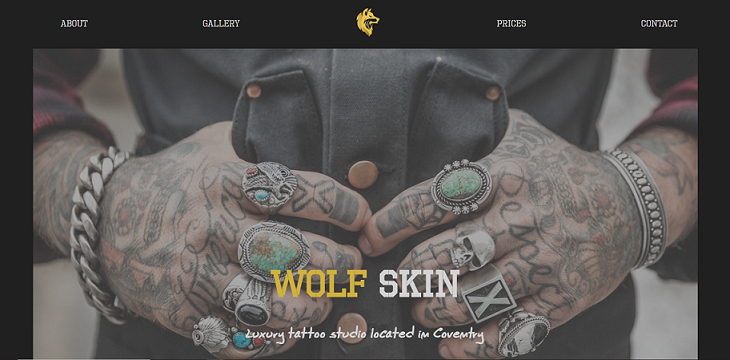

# wolfSkin
kateeliza.co.uk/wolfSkin.php

## Introduction
A fictional one-page site for a tattoo parlour, created in July 2020.  
There were multiple aims for this project: 
* To practice using Sass. 
* To develop design skills. 
* To create custom icons using Inkscape. 
* To build an image carousel from scratch. 

## Technologies Used
* HTML
* CSS/Sass
* JavaScript
* Inkscape

## Screenshot

